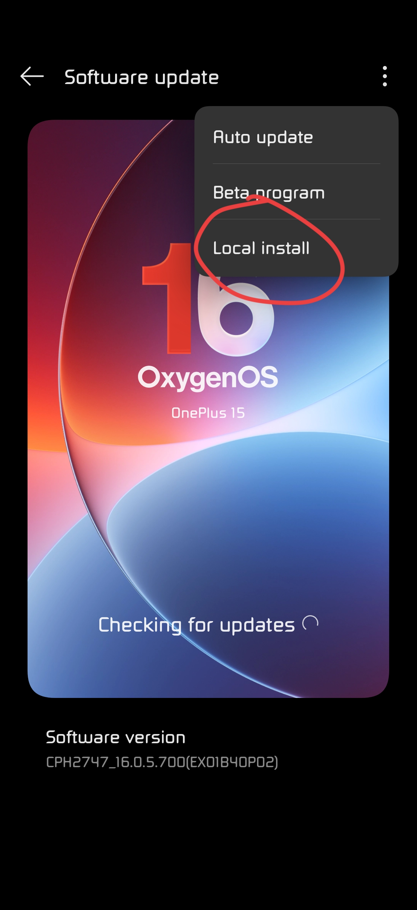
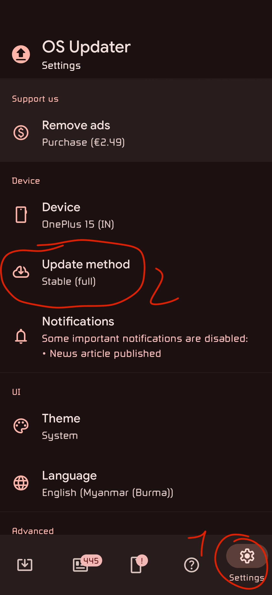

# How to do a region swap
## __WARNING : This is for swiching OOS regions, not going from ColorOS to OxygenOS, if you want to switch from COS to OOS, please read the [COS2OOS.md](./COS2OOS.md) guide__
## __WARNING 2 : I am not responsible if something goes wrong__

## Requirements
- An OxygenOS OnePlus
- An internet connection on your phone
- Latest version of your actual region needs to be the same as the latest version of the region you want to switch
- OxygenUpdater installed on your phone (the app is now called OS updater)

## Devices with a locked bootloader
### 0. Preparing
This guide will not work on bootloader unlocked devices since the local update feature is disabled once the bootloader is unlocked (don't ask why, I don't know neither why they did this)

Your device needs to have the local install option under software update, it should look like this

To enable Local installation, you need to enable developper options. Here are the steps to enable developpper options :
- Go to settings -> About device -> Version
- Click 7 times on "version number"
- Enter your pin
- You should now be a developper

Now that local installation is enabled, we can start downloading

### 1. Downloading the ROM
- Open OS Updater
- Go to settings -> update method
- Select stable(full) 
- Go back to the main tab (the update tab) and click "Download update"
- (_reccomended_) Rename the update file to something like "old.zip"
- Go back to OS Updater's settings tab -> Device and pick the region you want to switch to
- "Update method" might switch to incremental again, so switch it back to "stable(full)"
- (_reccomended_) Rename the update file to something like "new.zip"

## 2. Swapping regions
- Go to system settings -> System & update -> software update -> click on 3 dots -> local install -> select old.zip __AND DON'T CLICK INSTALL__
- While not closing this app, go remove old.zip and rename new.zip to old.zip
- Go back to the update page and click install
- Wait for the phone to install the update, when finished, you should have swapped the update with other regions, this will also swap OTAs

### 3. Checking if it worked
- Go to Settings -> About device -> version

The first characters of the version number and the hardware version should have changed, it's the device model, here are the names for each region

|Region|Hardware name       |
|------|--------------------|
|US    |CPH2749             |
|EU    |CPH2747EEU / CPH2747|
|GLO   |CPH2747             |
|IN    |CPH2745             |

## Devices with an unlocked bootloader
### 0. Preparing
You only need to download the RegionalFlasher for your device on [DanielSpringer's website](https://roms.danielspringer.at/index.php?dir=Oneplus+15%2FRegional+Flashers). Note that you cannot downgrade using this method, your system will fail booting and will go back to the previous update slot

### 1a. Swapping regions (fastboot method)
When you unzip the file, you should have a Regional_Flasher.bat file (or Regional_Flasher.sh if you use linux), this is the installation script, he will do most of the job

- If you are on linux, make sure you have fastboot installed (only the windows version is pre-included in the flasher zip)
- Reboot your phone to fastboot mode using `adb reboot fastboot`
- Execute the flasher script
- Your phone should reboot if everything went correctly

### 1b. Swapping regions (OrangeFox method)
- Put the Regional_Flasher zip on your phone
- Reboot to recovery
- Install the Regional_flasher zip
- Reboot

### 2. Checking if it worked
- Go to Settings -> About device -> version

The first characters of the version number and the hardware version should have changed, it's the device model, here are the names for each region

|Region|Hardware name       |
|------|--------------------|
|US    |CPH2749             |
|EU    |CPH2747EEU / CPH2747|
|GLO   |CPH2747             |
|IN    |CPH2745             |

